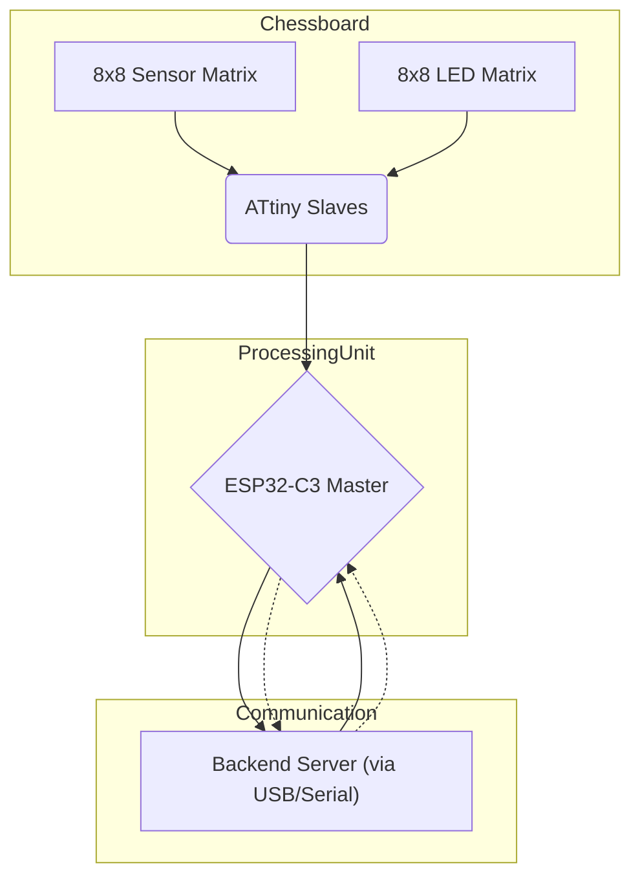

# Hardware Overview

The ChessLink hardware is designed to detect chess moves accurately on a physical board without interfering with the traditional feel of the game.

## Core Components

*   **Sensor Array:**
    *   An 8x8 matrix of phototransistors paired with LEDs detects the presence and movement of chess pieces through light interruption. Each piece is labelled with a sticker indicating the colour that they represent. 

    *   An 8x8 matrix of RGB LEDs is embedded in each square for visual feedback.
*   **LED System:**
    *   An 8x8 matrix of RGB LEDs is embedded within each square.
    *   Used for visual feedback, move validation indication, training guidance, and highlighting squares.
*   **Microcontrollers:**
    *   **Master:** 4 independdent Arduino microcontroller conduct their own sensing and report results back via serial.
    *   **Slaves:** 16 ATtiny microcontrollers likely manage specific rows/columns of sensors/LEDs, communicating with the master via UART.
*   **PCB Design:** A custom multi-layer Printed Circuit Board integrates all electronic components.
*   **Power System:** A regulated 5V system powers all components.
*   **I/O Interface:** Communication with the backend server occurs via a Serial/USB connection. Bluetooth/WiFi capabilities might be present on the ESP32-C3 for future enhancements.

## Functionality

The hardware detects piece movement using the phototransistors and LEDs. This data is processed by the microcontrollers and sent to the backend server via the serial connection. The LEDs provide visual feedback based on instructions received back from the server or based on internal logic.

_Diagram: High-level hardware component interaction._ 