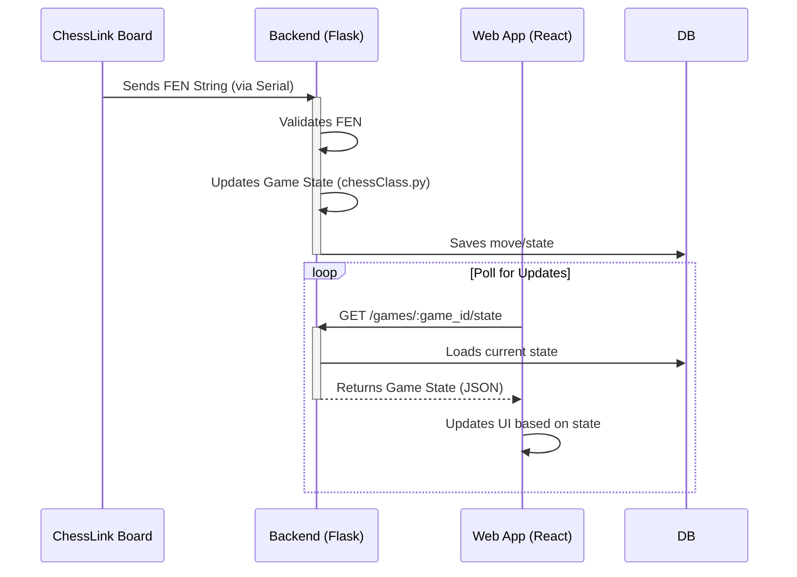

# Software Overview

The ChessLink software ecosystem consists of a backend server and a frontend web application.

## Backend (Flask Server - `server/app.py`)

The backend is a Python Flask application responsible for:

*   **Hardware Communication:**
    *   Connecting to the chessboard hardware via a specified serial port.
    *   Continuously reading data (expected to be FEN strings representing board states) from the serial connection in a background thread.
    *   Validating incoming FEN strings.
*   **Game Logic & State Management:**
    *   Utilizing the `chessClass.py` module to manage game states, validate moves based on standard chess rules, and potentially generate algebraic/UCI notation (though the FEN reading suggests it primarily receives states).
    *   Processing a queue of received FEN positions to update the game state.
*   **Database Interaction:**
    *   Saving new games with metadata (event, site, players) to a SQLite database (`server/chess_games.db`).
    *   Loading existing games from the database.
    *   Storing game moves (represented by FEN states) and results in the database.
*   **API Endpoints:** Exposing a RESTful API for the frontend:
    *   `POST /games`: Create a new game instance.
    *   `GET /games/<game_id>`: Retrieve details and move history for a specific game.
    *   `GET /games`: List all games stored in the database.
    *   `POST /games/<game_id>/update-result`: Update the result (e.g., '1-0', '0-1', '1/2-1/2') of a finished game.
    *   `GET /serial/ports`: List available serial ports on the server.
    *   `POST /serial/connect`: Establish a connection to the hardware on a specific port for a given game ID.
    *   `POST /serial/disconnect`: Close the serial connection and save the final game state.
    *   `GET /games/<game_id>/state`: Get the real-time state of the currently active game (including moves and connection status).

## Frontend (Vite/React - `src/`)

The frontend is a modern web application built using:

*   **Framework:** React with TypeScript.
*   **Build Tool:** Vite.
*   **Styling:** Tailwind CSS and shadcn/ui components.
*   **Routing:** `react-router-dom` for handling navigation between pages (Overview, Demo, Play Chess, etc.).

Key frontend components include:

*   `App.tsx`: Sets up the main application structure, providers (QueryClient, Tooltip), and routing.
*   `Navbar.tsx`: Provides navigation across the site.
*   `Hero.tsx`, `Features.tsx`, `Overview.tsx`: Components displaying information on the main page.
*   `Chess.tsx`, `ChessBoard.tsx`: Responsible for displaying the chessboard UI, likely interacting with the backend API to show game state.
*   `Demo.tsx`: Provides an interactive demonstration of the system.
*   `Play.tsx`: The page/component used for actively playing a game connected to the hardware.

## Data Flow (Hardware -> Backend -> Frontend)

1.  A physical move is made on the board.
2.  The hardware sensors detect the change.
3.  The microcontroller(s) process the sensor data and generate a FEN string representing the new board state.
4.  The FEN string is sent over the serial connection to the Flask backend.
5.  The Flask backend's serial reading thread receives and validates the FEN string.
6.  The validated FEN string is added to the active game's state queue and processed (`chessClass.py`).
7.  The Frontend application periodically fetches the game state (`/games/<game_id>/state`) from the backend API.
8.  The Frontend UI updates to reflect the new board state received from the API. 