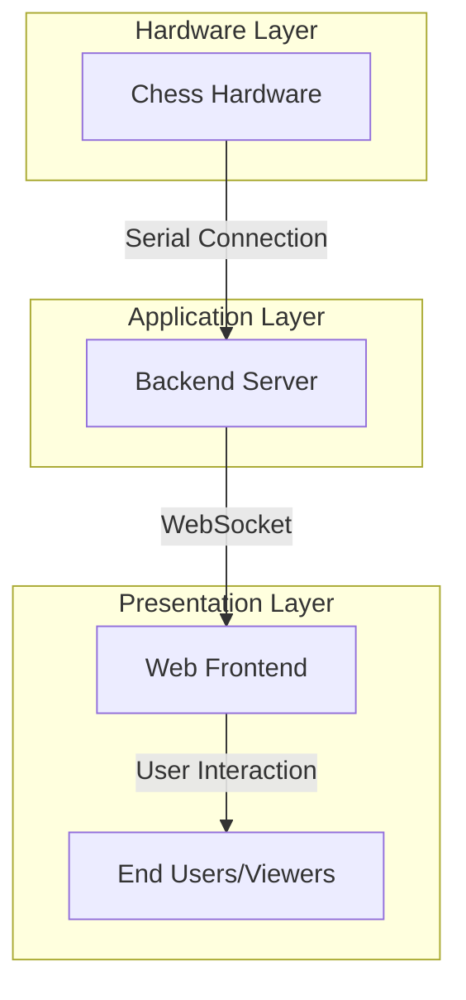
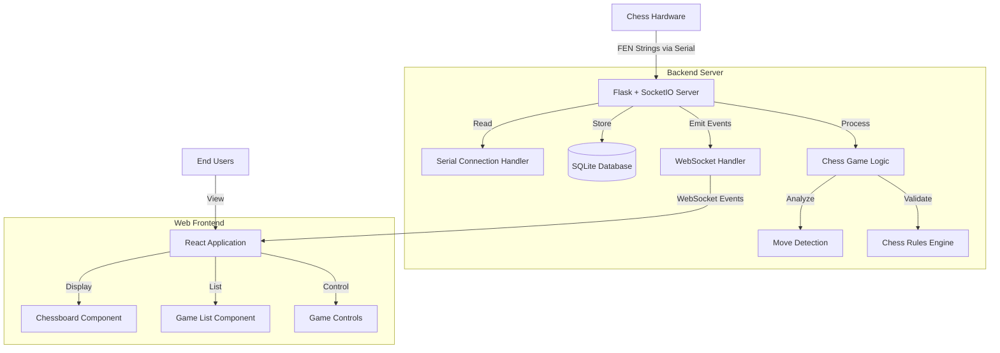
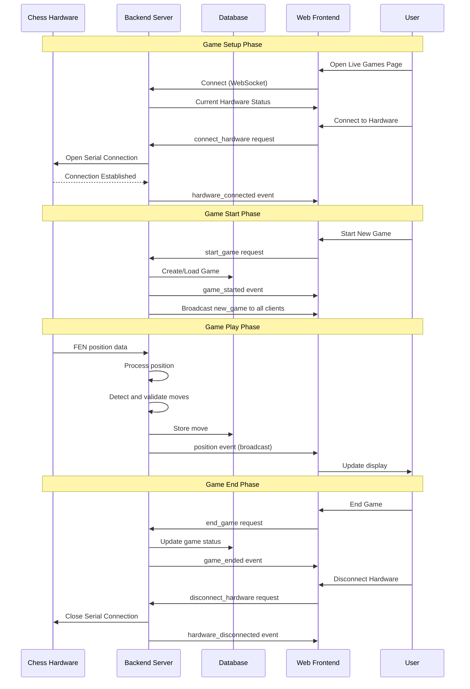
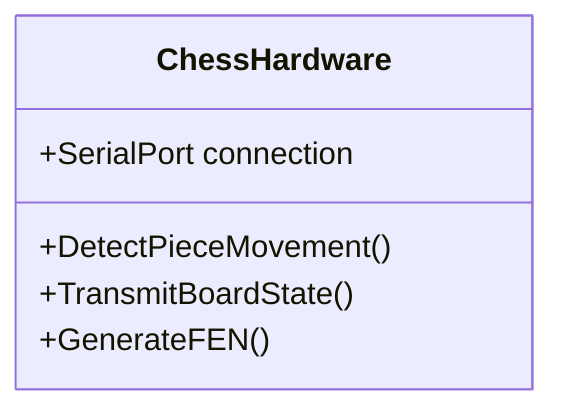
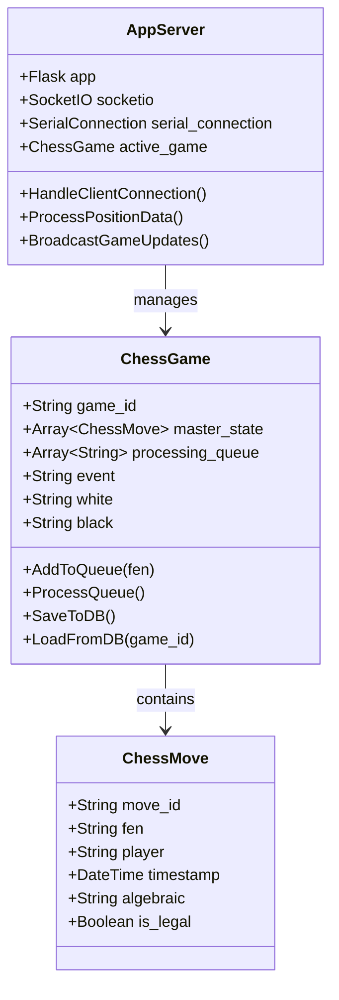
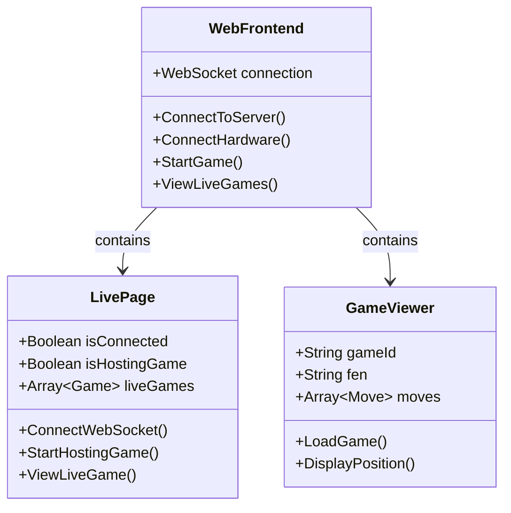

# ChessLink System Architecture

This document provides a comprehensive overview of the ChessLink system architecture, data flow, and testing procedures.

## System Overview

ChessLink is a system that connects physical chess hardware to a web application, allowing live broadcasting of chess games. The system consists of three main components:

1. **Chess Hardware** - Physical electronic chessboard that detects piece movements
2. **Backend Server** - Python Flask application with WebSocket support for real-time communication
3. **Web Frontend** - React application that displays live chess games



## Detailed Architecture



## Data Flow



## Component Descriptions

### 1. Hardware Layer

The hardware layer consists of an electronic chessboard that detects piece movements and transmits the board state to the server as FEN (Forsyth–Edwards Notation) strings via a serial connection.



### 2. Backend Server

The backend is built with Flask and Flask-SocketIO, providing both REST API endpoints and WebSocket connections. It handles:
- Hardware connections via serial port
- Game state management
- Move detection and validation
- Data persistence
- Real-time communications



### 3. Web Frontend

The React-based frontend provides a user interface for:
- Connecting to chess hardware
- Starting/managing live games
- Viewing game broadcasts
- Browsing historical games



## Testing the System

### Prerequisites

1. Python environment with required packages:
   - flask
   - flask-socketio
   - flask-cors
   - python-socketio
   - pyserial
   - chess
   - sqlalchemy

2. Node.js and npm for the React frontend

### Step 1: Start the Backend Server

```bash
# Navigate to the server directory
cd /path/to/website/server

# Create and activate virtual environment (if not already done)
python -m venv venv
source venv/bin/activate  # On Windows: venv\Scripts\activate

# Install dependencies
pip install -r requirements.txt

# Start the server
python app.py
```

The server will start on `http://localhost:8765`.

### Step 2: Test the Server Without Hardware

You can test the server functionality without physical chess hardware using the mock hardware connection:

```bash
# Run the comprehensive test script
python test_full_flow.py
```

This script:
1. Connects to the server via WebSocket
2. Uses a simulated (mock) hardware connection
3. Starts a new chess game
4. Sends a series of chess positions to simulate game play
5. Verifies the server's responses

### Step 3: Start the Frontend

```bash
# Navigate to the website root directory
cd /path/to/website

# Install dependencies (if not already done)
npm install

# Start the development server
npm run dev
```

The frontend will be available at `http://localhost:5173` (or another port if 5173 is in use).

### Step 4: Testing with the Web Interface

1. Open your browser and navigate to `http://localhost:5173`
2. Go to the Live Games page
3. Click "Connect to ChessLink" to establish a WebSocket connection
4. If you have physical chess hardware:
   - Connect it to your computer
   - Click "Connect to Hardware" and select the appropriate port
5. If you don't have physical hardware:
   - Use the "MOCK" port in testing scripts
6. Once connected:
   - Configure game details (title, player names)
   - Click "Start Live Game"
7. The game will appear in the "Watch Games" tab
8. Click "Watch Game" to view the live broadcast

## Testing with Real Hardware

If you have physical ChessLink hardware:

1. Connect the hardware to your computer via USB
2. Start the server as described above
3. From the frontend, connect to the hardware by selecting the appropriate port
4. Start a game
5. Make moves on the physical board
6. Observe the moves being transmitted to the web interface in real-time

## Simulating Hardware for Testing

For development and testing without physical hardware:

1. Use the provided `test_full_flow.py` script which simulates hardware input
2. Modify the script to generate your own sequence of moves if desired
3. Use the 'MOCK' port when connecting from your own testing scripts

## Troubleshooting

### Common Issues:

1. **Server won't start**
   - Check if port 8765 is already in use
   - Verify all dependencies are installed

2. **Cannot connect to hardware**
   - Verify the hardware is properly connected
   - Check if the port is correct
   - Try a different USB port

3. **Moves not being detected**
   - Check the hardware connection
   - Verify the hardware is sending valid FEN strings
   - Check server logs for parsing errors

4. **WebSocket connection fails**
   - Verify the server is running
   - Check for CORS issues
   - Verify the correct WebSocket URL is being used

## System Limitations

1. Currently supports only one active game at a time
2. Requires continuous connection to hardware during game play
3. Limited validation of illegal moves
4. No authentication/authorization for game management

## Future Enhancements

1. Multiple simultaneous games
2. User authentication
3. More sophisticated move analysis
4. Mobile app support
5. Enhanced game statistics and analytics 